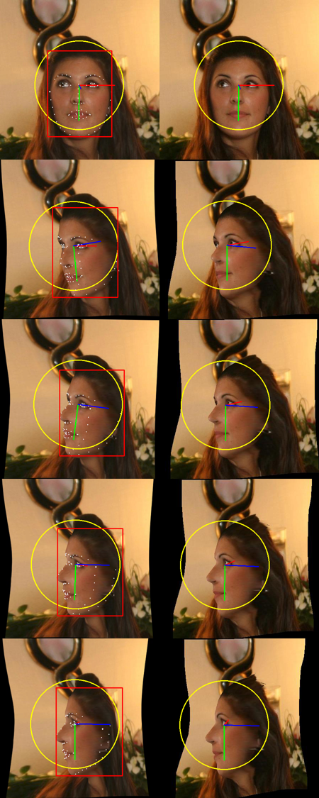
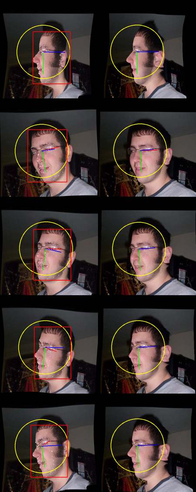
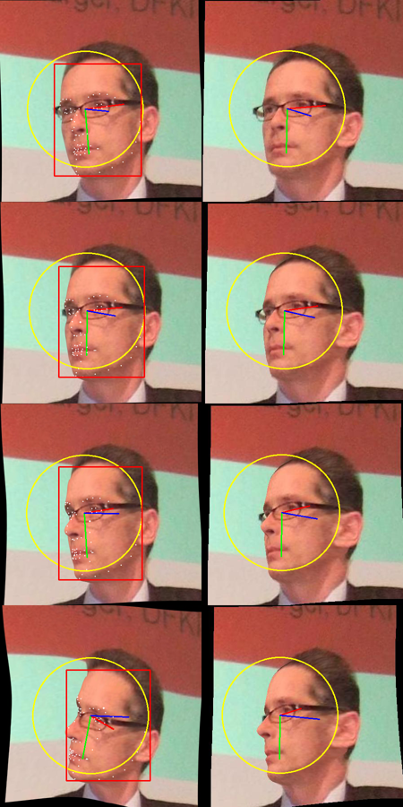
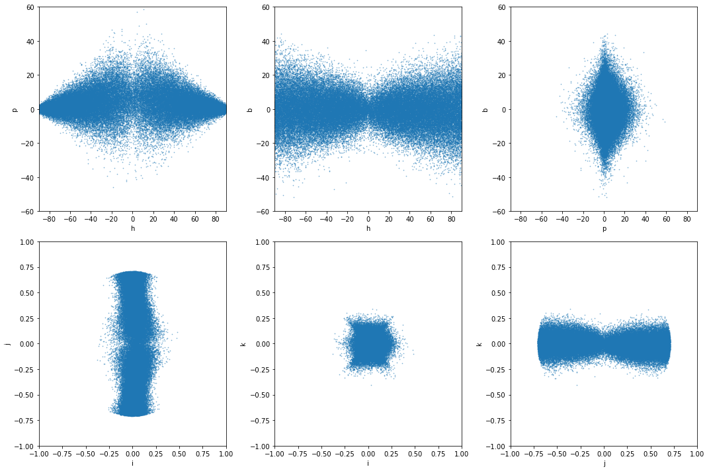
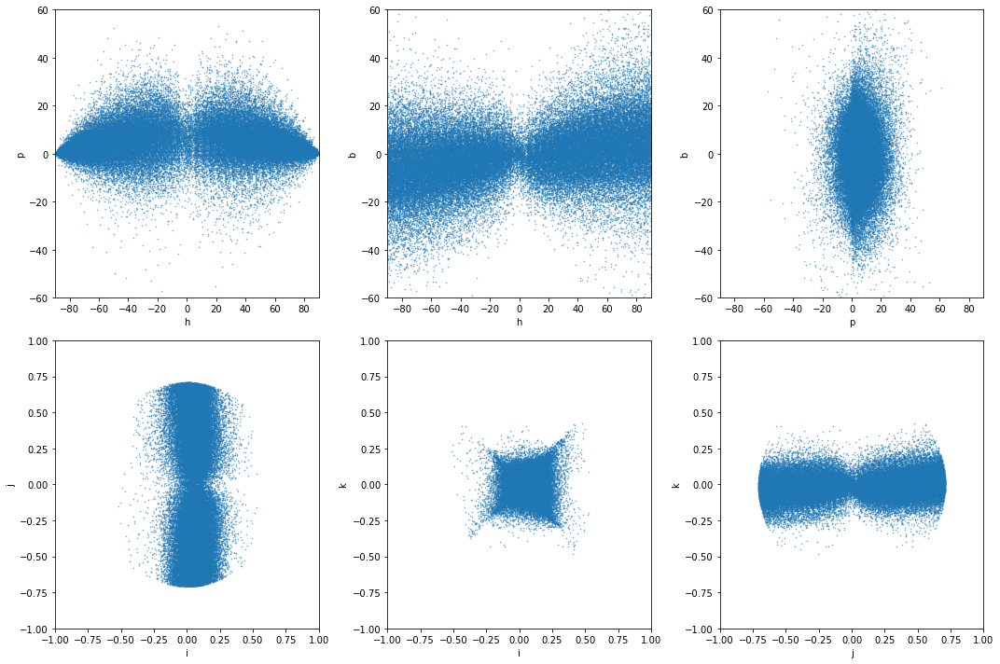

Face 3d Rotation Augmentation / Synthesis
=========================================

This is a reproduction of the augmentation that was used to expand the
face pose datasets for the creation of the 300W-LP dataset. (http://www.cbsr.ia.ac.cn/users/xiangyuzhu/projects/3DDFA/main.htm)

**It only covers the synthesis. Not the initial fitting.** Therefore a dataset with ground truth is required. Currently the original 300W-LP dataset.

Outputs
-------

Beware hat the output format is different from 300W-LP.

The code currently produces a hdf5 with

* filename of the output image
* rotation quaternion
* roi in x0,y0,x1,y1 format
* 3-element vector composed of xy and size
* 50 shape parameters. First 40 are for actual face shape, the last 10 for expressions. This relates to the shape and expression basis used in https://github.com/cleardusk/3DDFA_V2 among other works.

The images are stored in a folder with the same name as the hdf5.
Coordinates are in image space. Y points down, X left and Z into the image.

In contrast to [1],[2] and all the other works I rescaled the shape basis + parameters and the head size. Moreover I moved the origin to a point between the eyes.

Results
-------

Generation of around 65000 samples similarly distributed as 300W-LP.

**Left:** Reproduction | **Right:** Original.
In both cases head size and orientation are plotted as well.
In the reproduction image, I also plot the 3d landmarks. In the
300 wlp dataset I don't make them available for simplicity.

Scatter plots of rotation parameters: Reproduction

vs. original

Extra augmentation
------------------

*Closed eyes*. Looks quite good in general and helps make more stable predictions. 
Probability to generate closed eyes must be cranked up quite hight to about 0.5.

*Spotlight*. Adds a light shining from the side with shadow casting. Looks bad and is riddled with artifacts from shadow mapping. Doesn't seem to help. :-< Be advised to generate only a small fraction of samples with this aug.

3d Rotation Estimation Application Study
----------------------------------------

I trained a 3d rotation estimation CNN on the new dataset and compared with the results from training on the original 300 wlp. The evaluation is done on 1970 samples from the AFLW 3d 2000 dataset. The remaining 30 samples are excluded due to extreme poses.

Dataset creation command: `python ./expand_dataset.py --yaw-step 5.0 --prob-closed-eyes 0.5 --prob-spotlight 0.001 $ORIGINAL_DATA_DIR/300W-LP.zip $DATA_DIR/300wlp_repro_extended.h5`

Mean absolute angle errors in degrees:

| Dataset  | Yaw  | Pitch | Roll | Average |
|----------|------|-------|------|---------|
| 300 wlp  | 5.24 | 3.19  | 3.51 |  3.98   |
| Mine     | **4.77** | **3.05**  | **3.09** |  **3.64**   |

This is 2022 SOTA level, and hence quite good considering the simplicity of the model which was essentially a Mobilenet 1 with quaternion regression.

Furthermore, to see the magnitude of systematic errors when closing ones eyes, I recorded a video of a 
test subject, marked the sections with eyes closed and recorded outputs from the trained estimators. 
Qualitatively we can see from the following plot that the new dataset leads to arguably lesser deflections
in the marked sections.

Yellow sections: Eyes closed. Red: Yaw. Green: Pitch. Blue: Roll. Saturated colors: My dataset. Light colors: 300wlp.
Especially by the end of the sequence, where the head is yawed, the improvements in stability are clearly visible.

The 3d model
------------

Here is a view of the wireframe

It's based on the Basel Face Model, facial-region-only variant, from 3DDFA_V2 [2]. I added a smooth transition to a flat background plane. Then added the mouth interior,
blend-shapes for closing eyes, as well as "teeth". I used Cinema4D to do it. The scene file is in the assets folder.

And some more views, including the morph targets with closed eyes.

Todo
----

* Make the output more standard. Pull requests are welcome.
* Deformation more similar to original.

References
----------

The work introducing the 300W-LP dataset [1],
the awesome 3d pose estimation project [2] from which I borrowed a few bits,
the Basel Face Model we're using [3] ...

* [1] *Zhu et al. (2015) Face Alignment Across Large Poses: A 3D Solution*
* [2] *Guo et al. (2020) Towards Fast, Accurate and Stable 3D Dense Face Alignment*
* [3] *P. Paysan et al. (2009) "A 3D Face Model for Pose and Illumination Invariant Face Recognition"*